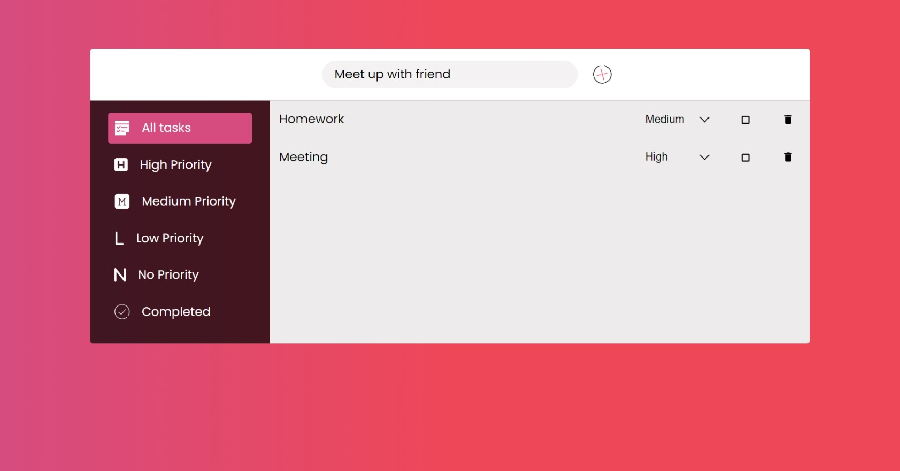
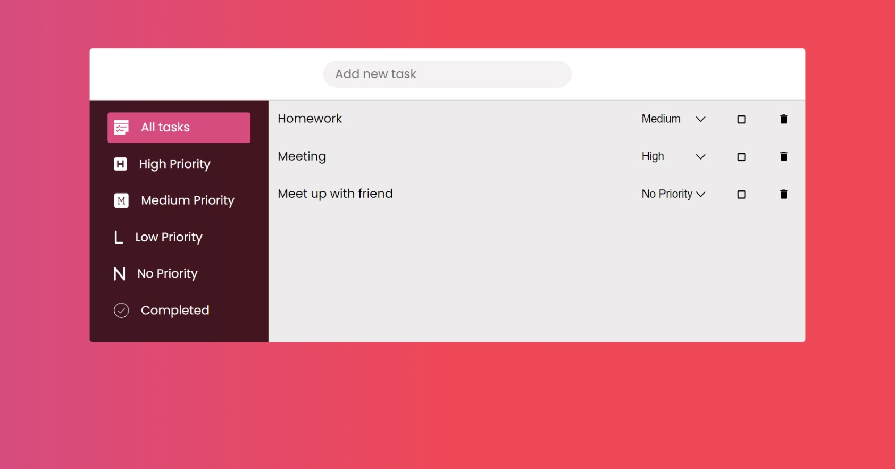
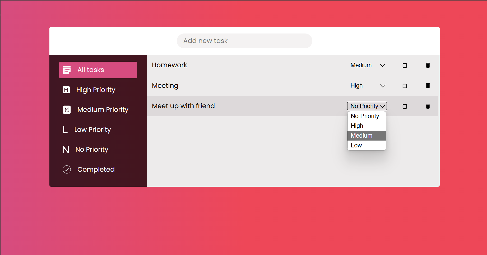
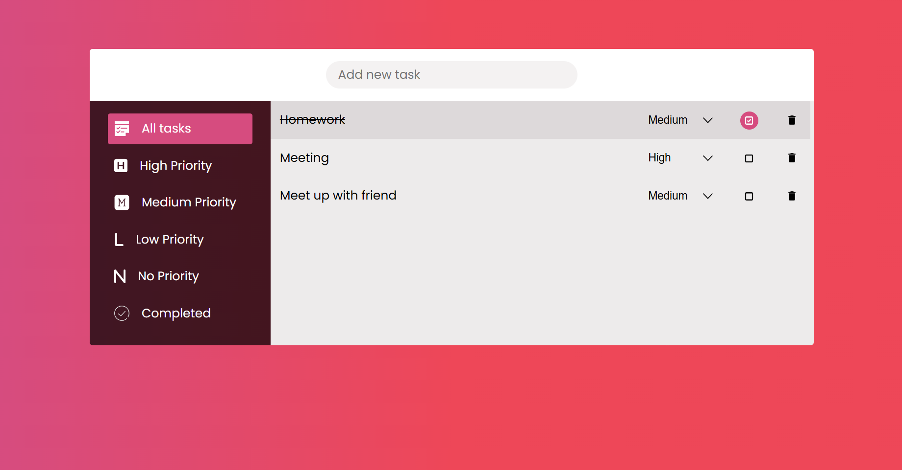
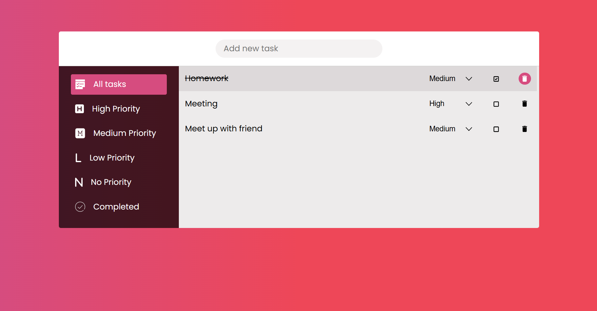
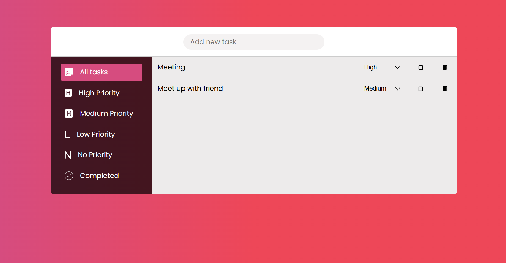

## Deployment

Test it out live: https://whatsinmytodo.vercel.app/

## Installation

```bash
git clone https://github.com/Ayush-Singh24/flarelink.git
cd flarelink
npm install
npm run dev
```

## About
ToDo is a user-friendly task management tool designed to help individuals streamline their productivity and stay on top of their to-do lists. With its intuitive interface and robust features, it enables users to efficiently manage tasks, prioritize, and track progress.

## Key Features

### Task Addition
Easily add new tasks with descriptions and due dates.


### Priority Setting
Assign priority levels (High, Medium, Low) to tasks.


### Completion Tracking
Mark tasks as Completed or Not Completed.


### Delete Feature
Remove tasks permanently.



## Assumptions
During the development of ToDo, I intentionally chose to use as few external libraries as possible.

I chose SCSS (Sass) over traditional CSS for TaskMaster's styling due to its numerous benefits:

1. Modularity: SCSS enables modular, reusable code through variables, mixins, and partials, making maintenance easier.
2. Nesting: SCSS's nesting feature simplifies CSS selectors, reducing code duplication and improving readability.
3. Variables: SCSS variables allow for consistent color schemes, typography, and spacing throughout the application.
4. Functions: SCSS functions enable complex calculations and transformations, streamlining styling tasks.
5. Compatibility: SCSS compiles to CSS, ensuring seamless browser compatibility.

Using SCSS enhanced my productivity, code organization, and overall styling efficiency, resulting in a more polished and maintainable UI.

I deliberately chose to forego modern technologies like Tailwind CSS, Shadcn components, and FramerMotion to showcase my foundational expertise in web development.

Here is a similar todolist project that I made especfically for learning Drag/Drop API:
https://note-flow-beta.vercel.app/
http://github.com/noteflow
